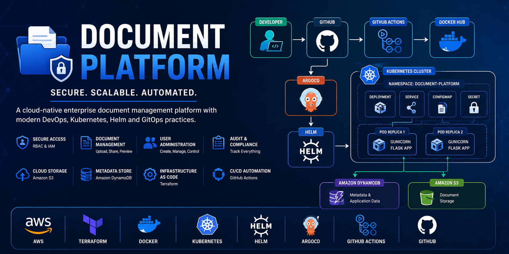
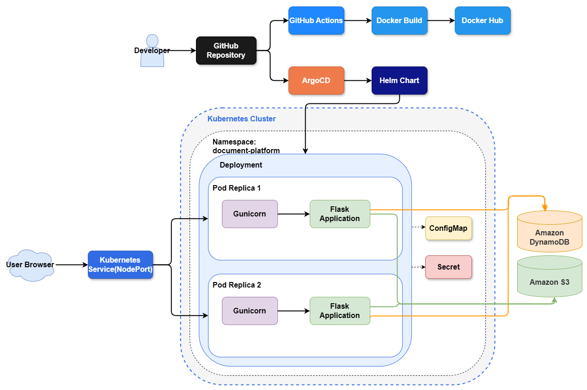

# Document Platform

A cloud-native enterprise document management platform built using AWS, Terraform, Docker, Kubernetes, Helm, GitHub Actions, and ArgoCD.

The platform enables secure document storage, retrieval, sharing, audit logging, and role-based access control while demonstrating modern DevOps, Platform Engineering, Infrastructure-as-Code, and GitOps practices.

---

<p align="center">
  
</p>

<p align="center">
  <strong>Cloud-Native Enterprise Document Management Platform</strong><br>
  Built with AWS, Terraform, Docker, Kubernetes, Helm, GitHub Actions, and ArgoCD
</p>

<p align="center">
  
  
  
  
  
  
  
</p>

---
# Quick Start

## Demo Mode (Recommended for Recruiters)

Run the complete platform locally:

```bash
git clone https://github.com/Swayanshu-Swain/document-platform.git

cd document-platform

./setup.sh
```

Access:

```text
Application:
minikube service document-platform-service --url

ArgoCD:
https://localhost:8080
```

---

## Developer Mode

Provision AWS infrastructure:

```bash
./infra-up.sh
```

Configure CI/CD:

```bash
./configure-github-secrets.sh
```

Push changes:

```bash
git push origin main
```

GitHub Actions automatically:

1. Builds the Docker image.
2. Pushes to DockerHub.
3. Updates deployment artifacts.
4. ArgoCD synchronizes the Kubernetes cluster.

---

## Cleanup

Destroy local resources:

```bash
./destroy.sh
```

Destroy AWS resources:

```bash
./infra-down.sh
```
---

## Table of Contents

- [What This Project Demonstrates](#what-this-project-demonstrates)
- [Quick Start](#quick-start)
- [Technology Stack](#technology-stack)
- [Project Highlights](#project-highlights)
- [Architecture](#architecture)
  - [Overview](#overview)
  - [Runtime Infrastructure](#1-runtime-infrastructure)
  - [AWS Infrastructure](#2-aws-infrastructure)
  - [Application Architecture](#3-application-architecture)
  - [CI/CD Deployment Pipeline](#4-cicd-deployment-pipeline)
  - [Kubernetes & GitOps Architecture](#5-kubernetes--gitops-architecture)
- [Design Decisions](#design-decisions)
- [Project Structure](#project-structure)
- [Repository Workflow](#repository-workflow)
- [Local Development Notes](#local-development-notes)
- [Screenshots](#screenshots)
- [Infrastructure Components](#infrastructure-components)
- [Deployment](#deployment)
- [Release History](#release-history)
- [Lessons Learned](#lessons-learned)
- [Future Enhancements](#future-enhancements)
- [Author](#author)
- [License](#license)

---

## What This Project Demonstrates

* AWS Infrastructure Provisioning with Terraform
* Docker Containerization
* CI/CD Automation with GitHub Actions
* Kubernetes Deployments
* Helm Chart Packaging
* GitOps Continuous Delivery using ArgoCD
* Secure Cloud Storage with S3 and DynamoDB
* Role-Based Access Control (RBAC)
* Audit Logging and Compliance Tracking

---

# Technology Stack

## Backend

* Python
* Flask
* Gunicorn

## Cloud Services

* Amazon EC2
* Amazon S3
* Amazon DynamoDB
* AWS IAM
* AWS Systems Manager (SSM)

## DevOps & Platform Engineering

* Docker
* Docker Hub
* GitHub Actions
* Terraform
* Kubernetes
* Helm
* ArgoCD

## Version Control

* Git
* GitHub

---

# Skills Demonstrated

## Cloud Engineering

* AWS Infrastructure Provisioning
* IAM Security Management
* DynamoDB Data Modeling
* S3 Object Storage Design
* Systems Manager Administration

## Infrastructure as Code

* Terraform Modules
* State Management
* Automated Resource Provisioning
* Environment Configuration

## DevOps Engineering

* Docker Containerization
* GitHub Actions CI/CD
* Image Registry Management
* Automated Deployments

## Platform Engineering

* Kubernetes Deployments
* Health Probes
* Resource Management
* Helm Packaging
* GitOps Workflows
* ArgoCD Continuous Delivery
* Self-Healing Infrastructure

## Backend Engineering

* Flask Application Development
* RBAC Authorization
* Session Management
* Audit Logging
* Service Layer Architecture

---

# Project Highlights

## Cloud Infrastructure

* Infrastructure provisioning using Terraform
* Amazon EC2 compute layer
* Amazon DynamoDB for metadata and authentication
* Amazon S3 for document storage
* IAM-based access management
* AWS Systems Manager (SSM) for remote administration

## Authentication & Authorization

* Secure user authentication
* Role-based access control (RBAC)
* Department-based authorization
* Session-based access management
* Admin-only management operations

## Document Management

* Document upload
* Secure document download
* File preview through pre-signed URLs
* File metadata management
* Soft-delete functionality
* File restoration
* Department-scoped document visibility

## Collaboration Features

* Document sharing across departments
* Shared document access management
* Shared document dashboard
* Access revocation support

## User Administration

* Create users
* Enable users
* Disable users
* Reset user passwords
* View registered users

## Audit & Compliance

* Centralized audit logging
* Upload tracking
* Sharing tracking
* Delete and restore tracking
* User administration tracking
* Audit dashboard with timeline view

---

# Architecture Overview

The project evolved through multiple deployment models:

```text
Local Development
        ↓
Dockerized Application
        ↓
AWS Cloud Deployment
        ↓
Kubernetes Orchestration
        ↓
Helm Packaging
        ↓
GitOps Continuous Delivery (ArgoCD)
```

---

# Architecture

## 1. Runtime Infrastructure


### Request Flow

```text
Browser
    ↓
Amazon EC2
    ↓
Docker Engine
    ↓
Docker Container
    ↓
Gunicorn
    ↓
Flask Application
    ↓
DynamoDB / S3
```

| Component        | Purpose                     |
| ---------------- | --------------------------- |
| Browser          | User interface              |
| EC2              | Compute infrastructure      |
| Docker Engine    | Container runtime           |
| Docker Container | Application environment     |
| Gunicorn         | WSGI server                 |
| Flask            | Backend application         |
| DynamoDB         | Metadata and authentication |
| S3               | Document storage            |

---

## 2. AWS Infrastructure


Provisioned Resources:

* EC2
* DynamoDB
* S3
* IAM
* Security Groups
* Systems Manager

---

## 3. Application Architecture


### Layered Design

```text
app.py
   │
Routes
   │
Services
   │
Models
   │
AWS Resources
```

### Route Layer

* auth_routes.py
* dashboard_routes.py
* file_routes.py

### Service Layer

* auth_service.py
* file_service.py
* audit_service.py
* dynamodb_service.py
* s3_service.py

### Model Layer

* user.py
* file.py

---

## 4. CI/CD Pipeline


```text
Developer
    ↓
Git Push
    ↓
GitHub Repository
    ↓
GitHub Actions
    ↓
Docker Build
    ↓
Docker Hub
    ↓
AWS Systems Manager
    ↓
EC2 Deployment
```

---

## 5. Kubernetes, Helm & GitOps Architecture



### Kubernetes Components

* Deployment
* Service
* ConfigMap
* Secret
* Liveness Probes
* Readiness Probes
* Resource Requests
* Resource Limits

### Helm Packaging

```text
helm/
└── document-platform
    ├── Chart.yaml
    ├── values.yaml
    └── templates/
```

### GitOps Workflow

```text
Developer
    ↓
Git Push
    ↓
GitHub Repository
    ↓
ArgoCD
    ↓
Helm Chart
    ↓
Kubernetes Cluster
    ↓
Document Platform
```

Features:

* Automated Synchronization
* Self-Healing Deployments
* Drift Detection
* Declarative Infrastructure

---

# GitOps Demonstration

A deployment validation was performed by updating the Helm chart replica count from **1 → 2**.

Workflow:

1. Modify `values.yaml`
2. Commit changes
3. Push to GitHub
4. ArgoCD detects repository change
5. Kubernetes synchronizes automatically
6. New replica becomes available

Result:

No manual deployment commands were executed.

---

# Project Structure

```text
document-platform/
│
├── backend/
├── terraform/
├── k8s/
├── helm/
│   └── document-platform/
├── gitops/
├── docs/
├── .github/
├── README.md
└── .gitignore
```
---
# Repository Workflow

```text
Developer
    ↓
Git Push
    ↓
GitHub Actions
    ↓
Docker Build
    ↓
DockerHub
    ↓
Helm Update
    ↓
ArgoCD
    ↓
Kubernetes Cluster
    ↓
Document Platform
```

The repository follows a GitOps workflow where Git serves as the single source of truth.

No manual deployment commands are required after pushing changes.

---

# Local Development Notes

## Accessing the Application

Recommended:

```bash
minikube service document-platform-service --url
```

---

## Accessing ArgoCD

```text
https://localhost:8080
```

Username:

```text
admin
```

The password is automatically displayed by `setup.sh`.

---

## About `document.local`

An Ingress resource is provided to demonstrate production-style Kubernetes routing.

```text
document.local
        ↓
NGINX Ingress Controller
        ↓
Kubernetes Service
        ↓
Document Platform Pods
```

Depending on the operating system and Minikube driver, `document.local` may require:

```bash
minikube tunnel
```

For portability across Linux, macOS, Windows, and WSL environments, the project documentation recommends using:

```bash
minikube service document-platform-service --url
```

as the default access mechanism.

---

# Screenshots

## Landing page


---

## Login Page


---

## Admin Dashboard


---
## Audit Log Dashboard


---

## User Management


---

## User Dashboard


---
## Share Document


---

## Upload Document


---

## GitHub Actions Deployment


---

## Docker Runtime


---

## Amazon DynamoDB


---

## Amazon S3


---

## Amazon EC2


---
## ArgoCD GitOps Dashboard


---

## Kubernetes Deployment


---


# Project Metrics

| Metric                | Value                                  |
| --------------------- | -------------------------------------- |
| AWS Services          | 5+                                     |
| Architecture Diagrams | 5                                      |
| Deployment Models     | 4                                      |
| Kubernetes Resources  | Deployment, Service, ConfigMap, Secret |
| GitOps Tool           | ArgoCD                                 |
| Package Manager       | Helm                                   |
| Backend Framework     | Flask                                  |

---

# Release History

| Version | Features                           |
| ------- | ---------------------------------- |
| v1.0.0  | AWS Deployment                     |
| v1.1.0  | Docker Containerization            |
| v1.2.0  | Kubernetes Migration               |
| v1.2.1  | Helm Packaging                     |
| v1.3.0  | GitOps with ArgoCD                 |
| v1.4.0  | One-Click Setup Scripts            |

---

# Lessons Learned

* Terraform Infrastructure Provisioning
* AWS Resource Security
* Docker Image Lifecycle
* GitHub Actions CI/CD
* Kubernetes Deployments
* Helm Chart Development
* GitOps with ArgoCD
* Repository Optimization
* Production Configuration Management

---

# Future Enhancements

## Infrastructure

* HTTPS / TLS
* Custom Domain
* Application Load Balancer
* CloudWatch Monitoring
* Auto Scaling
* EKS Migration

## Platform Features

* File Versioning
* Advanced Search
* MFA
* Folder Hierarchies
* Notifications
* Bulk Upload

## Platform Engineering

* Blue-Green Deployments
* Canary Deployments
* Service Mesh
* Multi-Environment GitOps

---

# Author

**Swayanshu Swain**

B.Tech Computer Science & Engineering
Silicon University, Bhubaneswar

---
# Contributing

Contributors can reproduce the complete development workflow:

```bash
./infra-up.sh
./configure-github-secrets.sh
git push origin main
./setup.sh
```
---

# License

This project is intended for educational, portfolio, and learning purposes.
