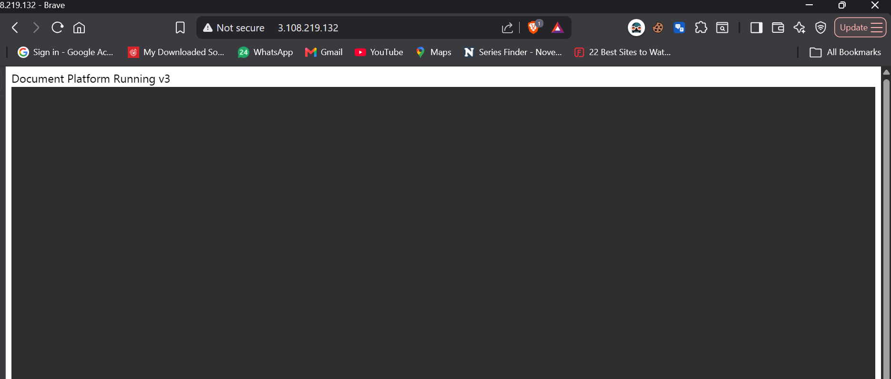

# Document Platform

A cloud-native document management platform built using AWS, Docker, Terraform, and GitHub Actions.

## Overview

This project demonstrates the complete lifecycle of a cloud-hosted application:

* Infrastructure provisioning with Terraform
* Containerized deployment using Docker
* CI/CD automation using GitHub Actions
* Storage using Amazon S3
* Metadata and authentication using DynamoDB
* Remote administration using AWS Systems Manager (SSM)

## Features

### Authentication & Authorization

* Login system
* Role-based access control

### Document Management

* Upload files
* Download files
* Share files
* File preview support

### Cloud Infrastructure

* Amazon EC2
* Amazon S3
* Amazon DynamoDB
* AWS IAM
* AWS Systems Manager

### DevOps

* Dockerized application
* Terraform Infrastructure as Code
* GitHub Actions CI/CD pipeline
* Docker Hub image registry

## Architecture

## CI/CD Workflow

1. Developer pushes code to GitHub
2. GitHub Actions builds Docker image
3. Image pushed to Docker Hub
4. GitHub Actions discovers EC2 instance by tag
5. Deployment executed through AWS SSM
6. EC2 pulls latest image
7. Existing container replaced automatically

## Screenshots

### Login Page

### Application

### GitHub Actions Deployment

### Docker Container

### DynamoDB

### S3

### EC2

## Infrastructure Components

| Service        | Purpose                     |
| -------------- | --------------------------- |
| EC2            | Hosts application           |
| Docker         | Application runtime         |
| DynamoDB       | User, file, and audit data  |
| S3             | Document storage            |
| SSM            | Remote deployment           |
| GitHub Actions | CI/CD                       |
| Docker Hub     | Container registry          |
| Terraform      | Infrastructure provisioning |

## Deployment

Terraform provisions:

* VPC
* Security Groups
* EC2 Instance
* S3 Bucket
* DynamoDB Tables
* IAM Roles
* SSM Access

Application deployment is fully automated through GitHub Actions.

## Future Enhancements

* Custom Domain
* HTTPS with Let's Encrypt
* Nginx Reverse Proxy
* CloudWatch Monitoring
* Application Load Balancer
* Auto Scaling
* Kubernetes (EKS)
* Helm
* ArgoCD
