# Document Platform

A cloud-native enterprise document management platform built with AWS, Terraform, Docker, and GitHub Actions. The platform provides secure document storage, sharing, auditability, user administration, role-based access control, and automated cloud deployment through a complete DevOps pipeline

This project demonstrates the complete software delivery lifecycle, from infrastructure provisioning and containerized deployment to automated CI/CD and cloud-native document storage.

The platform provides secure document storage, retrieval, sharing, and metadata management while showcasing modern DevOps and Infrastructure-as-Code practices.

---

## Project Highlights

### Cloud Infrastructure
- Infrastructure provisioning using Terraform
- Amazon EC2 compute layer
- Amazon DynamoDB for metadata and authentication
- Amazon S3 for document storage
- IAM-based access management
- AWS Systems Manager (SSM) for remote administration

## Application Features

### Authentication & Authorization

* Secure user authentication
* Role-based access control (RBAC)
* Department-based authorization
* Session-based access management
* Admin-only management operations

### Document Management

* Document upload
* Secure document download
* File preview through pre-signed URLs
* File metadata management
* Soft-delete functionality
* File restoration
* Department-scoped document visibility

### Collaboration Features

* Document sharing across departments
* Shared document access management
* Remove shared access
* Shared document dashboard

### User Administration

* Create users
* Enable users
* Disable users
* Reset user passwords
* View all registered users

### Audit & Compliance

* Centralized audit logging
* Upload activity tracking
* Share activity tracking
* Delete and restore tracking
* User administration activity tracking
* Audit dashboard with timeline view

### Dashboard Experience

#### Administrator Dashboard

* Platform-wide statistics
* User metrics
* Document metrics
* Shared file metrics
* Audit activity metrics
* Recent audit timeline

#### User Dashboard

* Personal file statistics
* Shared document visibility
* Deleted file visibility
* Recent document management


### DevOps & Automation
- Dockerized application deployment
- GitHub Actions CI/CD pipeline
- Docker Hub image registry
- Automated deployment via AWS SSM
- Infrastructure as Code (IaC)

---

# Skills Demonstrated

### Cloud Engineering
- AWS Infrastructure Provisioning
- IAM & Security Management
- DynamoDB Design
- S3 Object Storage

### DevOps
- Docker Containerization
- CI/CD Pipeline Design
- Infrastructure as Code (Terraform)

### Platform Engineering
- Kubernetes Deployments
- Helm Packaging
- GitOps with ArgoCD
- Configuration Management
- Self-Healing Deployments

### Backend Development
- Flask Web Applications
- RBAC Authorization
- Audit Logging
- REST Architecture

---

# Architecture

The project architecture is documented using four different perspectives.

---

## 1. Runtime Infrastructure

This diagram shows how requests flow through the deployed runtime environment.

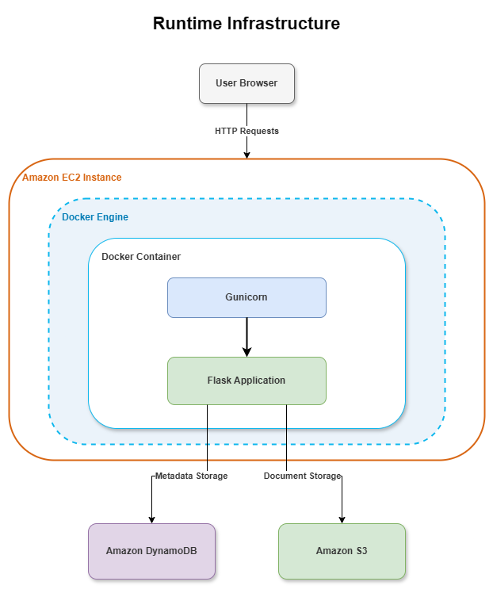

### Request Flow

```text
Browser
    ↓
Amazon EC2
    ↓
Docker Engine
    ↓
Docker Container
    ↓
Gunicorn
    ↓
Flask Application
    ↓
DynamoDB / S3
```

Responsibilities:

| Component | Purpose |
|------------|----------|
| Browser | User interface |
| EC2 | Compute infrastructure |
| Docker Engine | Container runtime |
| Docker Container | Application environment |
| Gunicorn | WSGI application server |
| Flask | Backend application |
| DynamoDB | Metadata and authentication storage |
| S3 | Document storage |

---

## 2. AWS Infrastructure

This diagram illustrates the AWS resources provisioned and managed through Terraform.

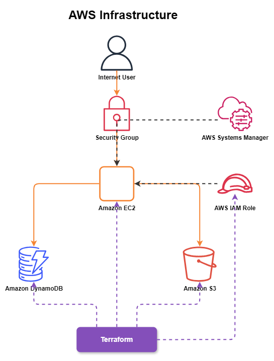

Provisioned Resources:

- Amazon EC2
- Amazon DynamoDB
- Amazon S3
- IAM Roles
- Security Groups
- AWS Systems Manager

Infrastructure provisioning is fully automated through Terraform.

---

## 3. Application Architecture

This diagram represents the internal structure of the Flask application.

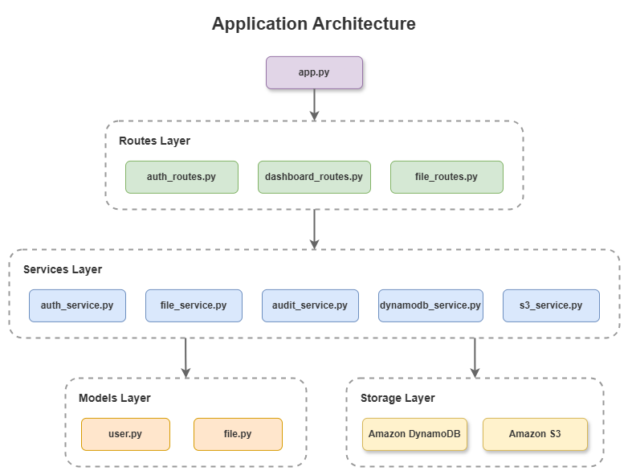

### Layered Design

```text
app.py
   │
Routes
   │
Services
   │
Models
   │
AWS Resources
```

### Route Layer

- auth_routes.py
- dashboard_routes.py
- file_routes.py

### Service Layer

- auth_service.py
- file_service.py
- audit_service.py
- dynamodb_service.py
- s3_service.py

### Model Layer

- user.py
- file.py

---

## 4. CI/CD Deployment Pipeline

This diagram demonstrates the automated deployment workflow.

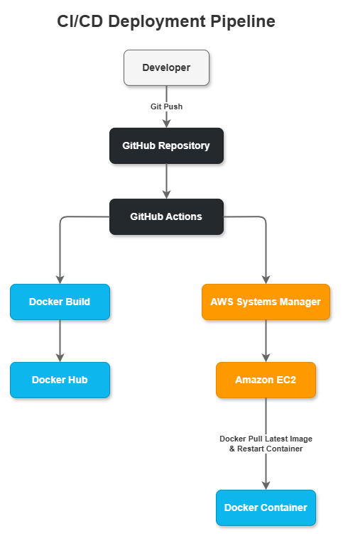

### Deployment Flow

```text
Developer
    ↓
Git Push
    ↓
GitHub Repository
    ↓
GitHub Actions
    ↓
Docker Build
    ↓
Docker Hub
    ↓
AWS Systems Manager
    ↓
Amazon EC2
    ↓
Docker Container Restart
```

Deployment occurs automatically whenever changes are pushed to the main branch.

---

## 5. Kubernetes & GitOps Architecture

The platform has been extended to support Kubernetes-native deployments using Helm and ArgoCD.

### Kubernetes Components

* Deployment
* Service
* ConfigMap
* Secret
* Liveness Probes
* Readiness Probes
* Resource Requests & Limits

### Helm Packaging

Application manifests are packaged as a reusable Helm chart.

```text
helm/
└── document-platform
    ├── Chart.yaml
    ├── values.yaml
    └── templates/
```

Helm provides:

* Environment-specific configuration
* Reusable deployments
* Versioned releases
* Simplified upgrades

### GitOps with ArgoCD

ArgoCD continuously monitors the Git repository and automatically synchronizes Kubernetes resources.

Deployment workflow:

```text
Developer
    ↓
Git Push
    ↓
GitHub Repository
    ↓
ArgoCD
    ↓
Helm Chart
    ↓
Kubernetes Cluster
    ↓
Document Platform
```

Features:

* Automated synchronization
* Self-healing deployments
* Drift detection
* Declarative infrastructure management

This architecture eliminates manual deployment commands and establishes Git as the single source of truth.

---

# Technology Stack

## Backend

- Python
- Flask
- Gunicorn

## Cloud Services

- Amazon EC2
- Amazon S3
- Amazon DynamoDB
- AWS IAM
- AWS Systems Manager

## DevOps & Platform Engineering

- Docker
- Docker Hub
- GitHub Actions
- Terraform
- Kubernetes
- Helm
- ArgoCD

## Version Control

- Git
- GitHub

---

# Design Decisions

## Why Terraform?

Terraform enables reproducible infrastructure provisioning and eliminates manual resource configuration.

## Why Docker?

Docker ensures environment consistency between development and deployment environments.

## Why DynamoDB?

DynamoDB provides a managed, scalable NoSQL datastore ideal for metadata and user management.

## Why Amazon S3?

S3 offers highly durable and cost-effective object storage for documents.

## Why AWS Systems Manager Instead of SSH?

SSM allows secure remote administration without exposing SSH ports to the public internet.

## Why GitHub Actions?

GitHub Actions provides seamless CI/CD integration directly from the source repository.

---

# Project Structure

```text
document-platform/
│
├── backend/
│   ├── auth/
│   ├── config/
│   ├── models/
│   ├── routes/
│   ├── services/
│   ├── templates/
|   ├── static/
│   ├── utils/
│   ├── app.py
│   └── Dockerfile
│
├── terraform/
│   ├── bootstrap/
│   └── infrastructure/
|
├── k8s/
|
├── helm/
│   └── document-platform/
|
├── gitops/
│
├── docs/
│   └── screenshots/
│
├── .github/
│   └── workflows/
│
├── README.md
└── .gitignore
```

---

# Screenshots

## Landing page

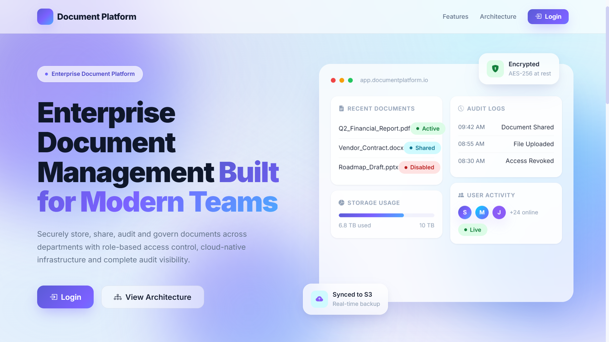

---

## Login Page

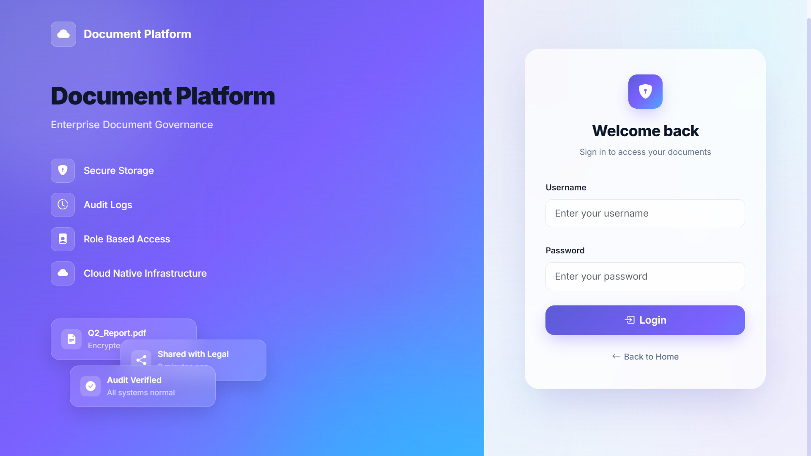

---

## Admin Dashboard

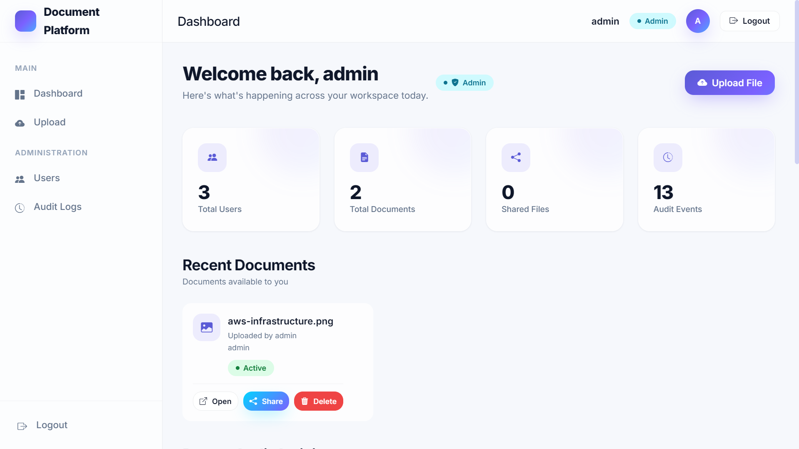

---
## Audit Log Dashboard

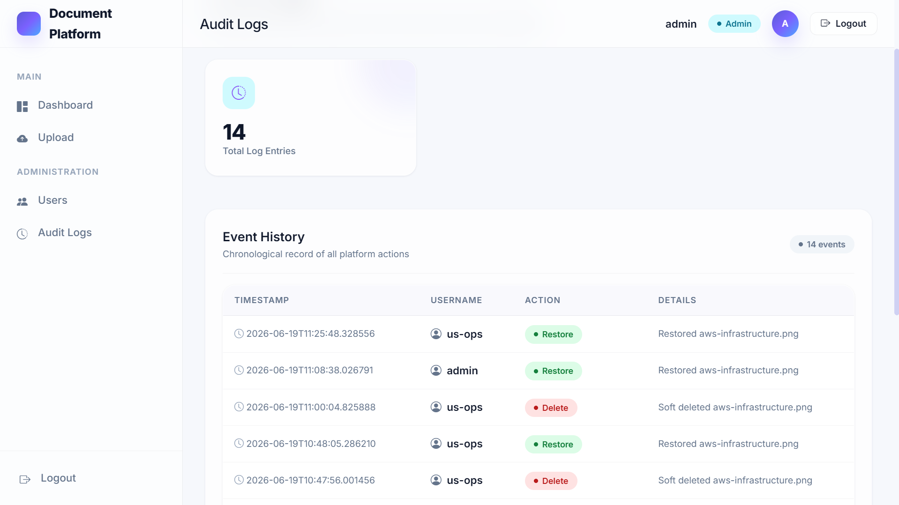

---

## User Management

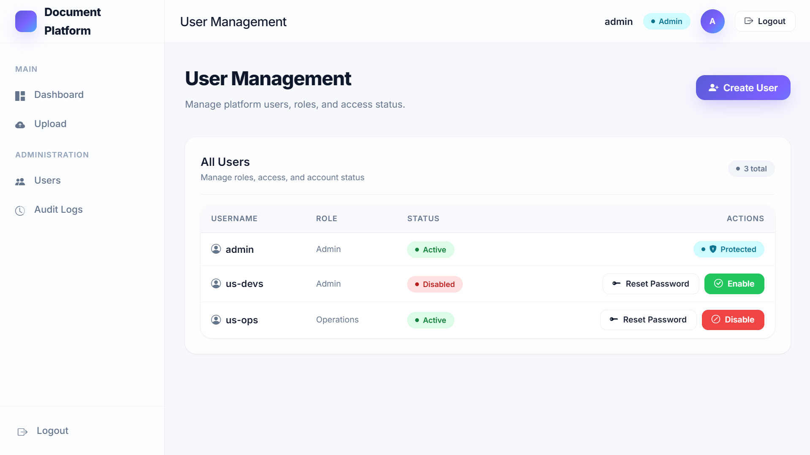

---

## User Dashboard

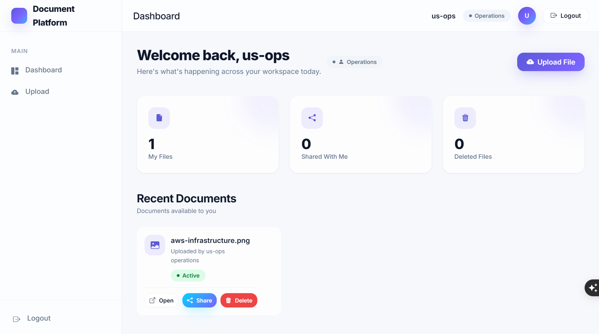

---
## Share Document

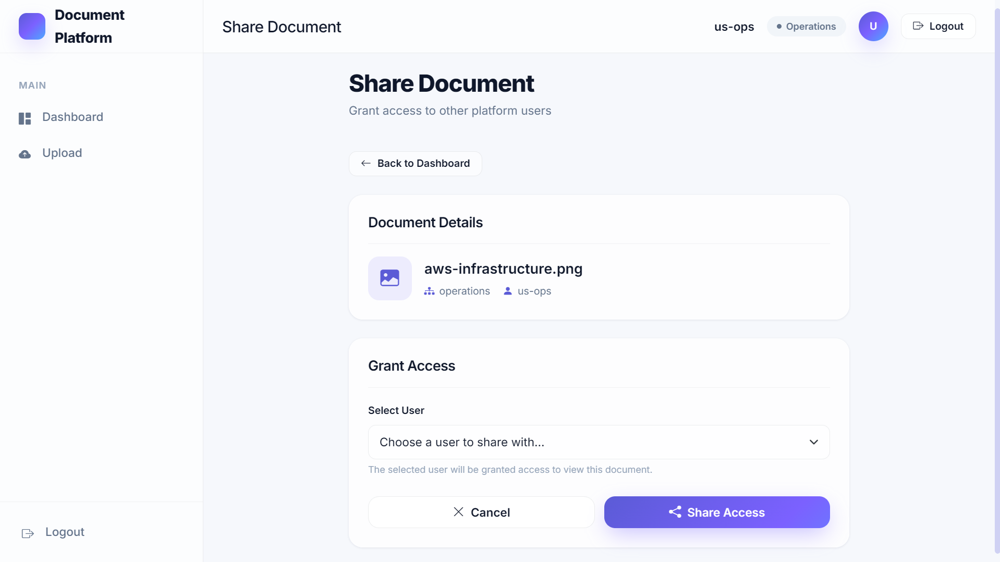

---

## Upload Document

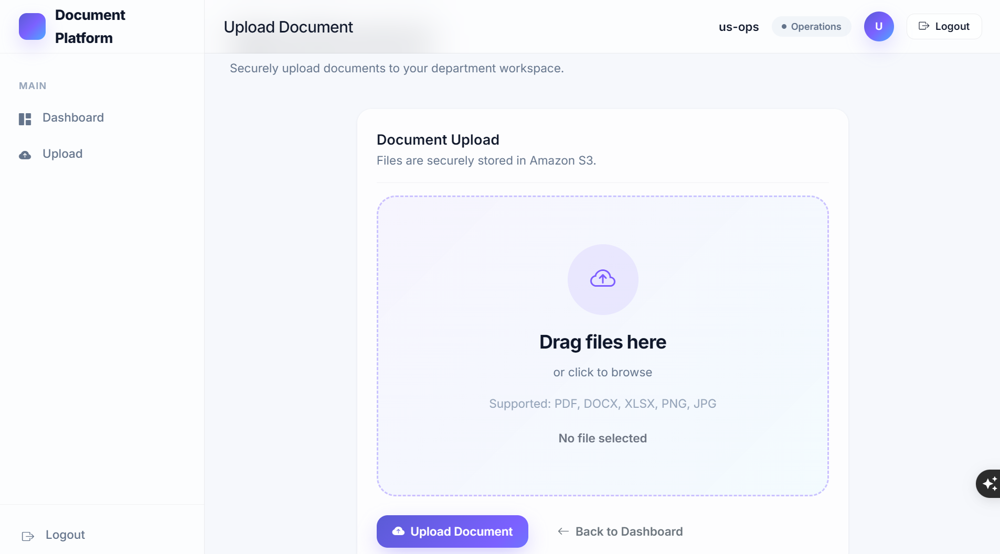

---

## GitHub Actions Deployment

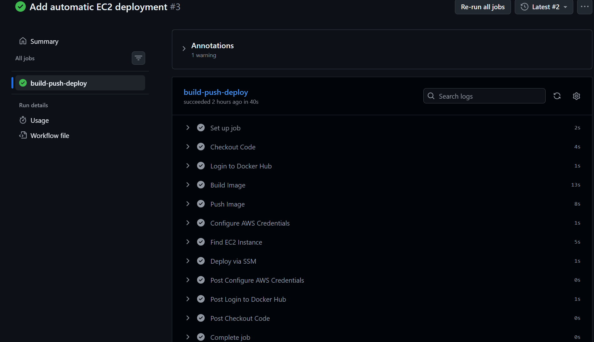

---

## Docker Runtime

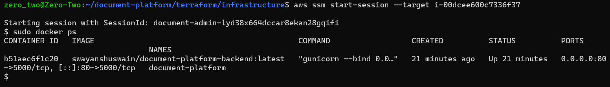

---

## Amazon DynamoDB

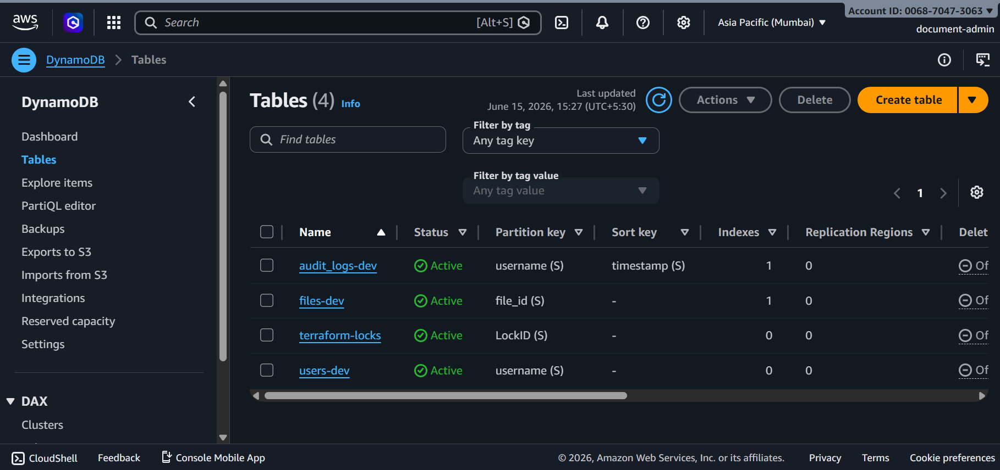

---

## Amazon S3

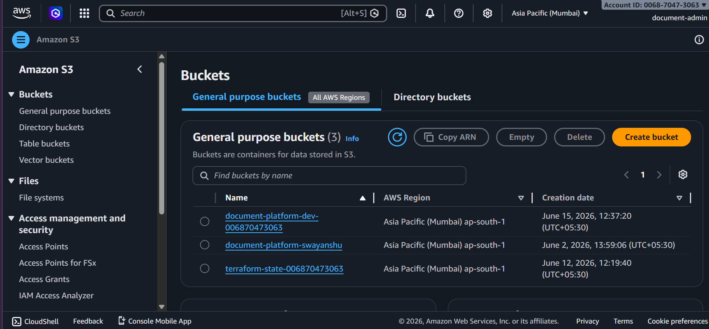

---

## Amazon EC2

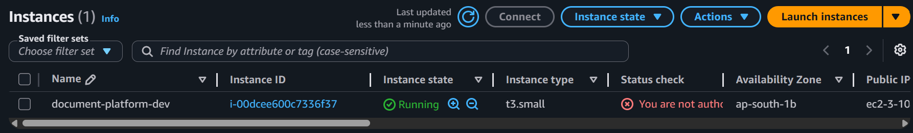

---
## ArgoCD GitOps Dashboard

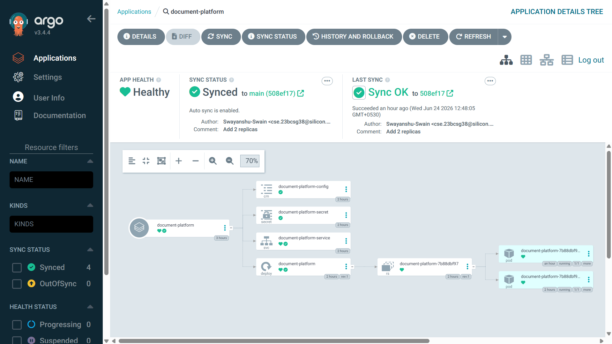

---

## Kubernetes Deployment

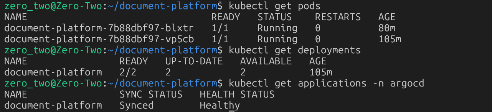

---

# Infrastructure Components

| Service | Responsibility |
|----------|---------------|
| EC2 | Hosts application runtime |
| Docker | Container execution |
| Gunicorn | Application server |
| Flask | Business logic |
| DynamoDB | Metadata storage |
| S3 | Document storage |
| IAM | Access management |
| SSM | Remote administration |
| GitHub Actions | CI/CD |
| Docker Hub | Image registry |
| Terraform | Infrastructure provisioning |

---

# Deployment

Infrastructure provisioning:

```bash
terraform init
terraform plan
terraform apply
```

Application deployment:

```text
Git Push
    ↓
GitHub Actions
    ↓
Docker Build
    ↓
Docker Hub
    ↓
AWS SSM
    ↓
EC2 Deployment
```

No manual server access is required during deployment.

---
# Release History

| Version | Features |
|----------|-----------|
| v1.0.0 | AWS-based Document Platform |
| v1.0.1 | Repository cleanup and stabilization |
| v1.1.0 | Kubernetes deployment |
| v1.2.0 | Helm chart packaging |
| v1.2.1 | Helm improvements and parameterization |
| v1.3.0 | ArgoCD GitOps deployment |

---

# Lessons Learned

During this project I gained hands-on experience with:

- Infrastructure provisioning using Terraform
- Secure AWS resource management
- Docker image creation and deployment
- CI/CD automation using GitHub Actions
- Kubernetes application deployment
- Helm chart development
- GitOps workflows using ArgoCD
- Repository optimization and Git history management
- Production-style configuration management

---

# Future Enhancements

### Infrastructure

- Custom Domain
- HTTPS (TLS/SSL)
- Nginx Reverse Proxy
- CloudWatch Monitoring
- CloudWatch Alarms
- Application Load Balancer
- Auto Scaling

### Platform Features

* Advanced Search & Filtering
* File Versioning
* Department Management
* Activity Notifications
* Bulk Upload Support
* Folder Hierarchy
* Document Expiration Policies
* Public Share Links
* Multi-Factor Authentication (MFA)
* User Profile Management

### Platform Engineering

- Kubernetes (EKS)
- Blue-Green Deployments

---

# Author

**Swayanshu Swain**

B.Tech Computer Science & Engineering  
Silicon University, Bhubaneswar

---

## License

This project is intended for educational, portfolio, and learning purposes.
